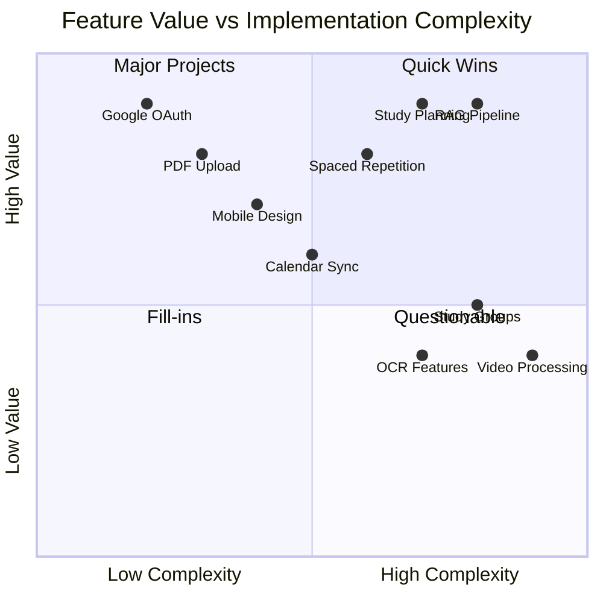

# Feature Inventory

---
id: product-features
owner: product-team
status: active
last_updated: 2025-08-12
links:
  - "[Problem Statement](../00-vision/problem.md)"
  - "[Domain Model](../06-domain-model/erd.md)"
  - "[AI Architecture](../08-ai/architecture.md)"
---

## Purpose
Complete prioritized feature inventory using MoSCoW methodology to guide development decisions and resource allocation for StudySharper's AI-powered study platform.

## Scope
All features from MVP launch through advanced AI capabilities, organized by user value and technical complexity.

## MoSCoW Feature Prioritization

### MUST HAVE (MVP Core - Launch Blockers)

#### 🔐 Authentication & User Management
- **Google OAuth Integration** - One-click sign-in with Google accounts
- **User Profile Creation** - Basic profile with timezone, study preferences
- **Account Management** - View/edit profile, delete account, data export

#### 🏫 Academic Structure Setup
- **School/Institution Management** - Add multiple schools/institutions
- **Term/Semester Management** - Create academic terms with start/end dates
- **Course Creation** - Add courses with name, code, credits, syllabus
- **Subject Organization** - Break courses into study subjects/topics

#### 📄 Content Ingestion
- **PDF Upload & Processing** - Extract text from course materials, syllabi
- **Manual Note Entry** - Rich text editor for typed notes
- **Content Chunking** - Intelligent splitting for embeddings (512 token max)
- **Metadata Extraction** - Auto-tag content by course, date, type

#### 🧠 Core AI Features
- **RAG Pipeline** - Question answering from uploaded content
- **AI Study Coach** - Generate personalized 7-day study plans
- **Content Embeddings** - Semantic search across user's materials
- **Provider Abstraction** - OpenRouter primary, Ollama fallback

#### 📅 Study Planning
- **Study Plan Generation** - AI-created weekly schedules
- **Calendar View** - Visual timeline of study blocks
- **Task Management** - Create, edit, complete study tasks
- **Deadline Tracking** - Assignment and exam deadline awareness

#### 📊 Basic Analytics
- **Study Session Tracking** - Time spent, focus rating, completion
- **Performance Metrics** - Track retention improvement over time
- **Progress Dashboard** - Visual progress on courses and subjects

### SHOULD HAVE (Enhanced MVP - High Value)

#### 🃏 Spaced Repetition System
- **Card Generation** - Auto-create flashcards from notes
- **SM-2 Algorithm** - Research-proven spaced repetition scheduling
- **Review Queue** - Daily cards due for review
- **Performance Tracking** - Difficulty ratings, retention curves

#### 🤖 Advanced AI Capabilities
- **AI Tutor Chat** - Conversational Q&A about study materials
- **Quiz Generation** - AI-created practice questions from content
- **Study Method Recommendations** - Suggest techniques per topic
- **Plan Optimization** - Continuous improvement based on performance

#### 📱 Enhanced UX
- **Mobile Responsive Design** - Full functionality on mobile devices
- **Keyboard Shortcuts** - Power user productivity features
- **Dark Mode** - Theme switching for different environments
- **Notification System** - Study reminders and deadline alerts

#### 🔗 Basic Integrations
- **Google Calendar Sync** - Import existing calendar events
- **URL Import** - Add web resources and articles
- **Export Functionality** - Download study plans, notes as PDF

#### 📈 Advanced Analytics
- **Cognitive Load Modeling** - Optimize study intensity by time of day
- **Forgetting Curve Analysis** - Personalized retention predictions
- **Study Pattern Recognition** - Identify optimal study habits
- **Performance Forecasting** - Predict exam readiness

### COULD HAVE (Future Enhancements - Medium Value)

#### 🎯 Personalization Engine
- **Learning Style Detection** - Visual, auditory, kinesthetic preferences
- **Adaptive Difficulty** - Content difficulty based on user progress
- **Procrastination Pattern Recognition** - Early warning systems
- **Motivation Tracking** - Mood and energy level correlation

#### 📚 Content Enhancement
- **OCR for Images** - Extract text from photos, diagrams
- **Video Transcript Processing** - Import lecture recordings
- **Web Scraping** - Auto-extract content from course websites
- **Multi-language Support** - Content in multiple languages

#### 🤝 Collaboration Features
- **Study Group Creation** - Share study plans with classmates
- **Peer Performance Comparison** - Anonymous benchmarking
- **Content Sharing** - Share notes and flashcards (with permission)
- **Group Study Sessions** - Collaborative study blocks

#### 🔧 Advanced Customization
- **Custom Study Methods** - User-defined study techniques
- **Advanced Calendar Integration** - Outlook, Apple Calendar sync
- **API Access** - Third-party app integrations
- **Custom AI Prompts** - Personalized AI behavior settings

#### 📊 Research & Insights
- **Learning Analytics Research** - Contribute to education research
- **A/B Testing Framework** - Continuous feature optimization
- **Usage Pattern Analysis** - Aggregate insights (anonymized)
- **Performance Benchmarking** - Compare against learning science research

### WON'T HAVE (Out of Scope - Current Release)

#### 🚫 Excluded Features
- **Live Video Tutoring** - Too complex, different product category
- **Full LMS Replacement** - Not competing with Canvas/Blackboard
- **Social Media Features** - Focus on productivity, not social
- **Gamification Elements** - Avoid addiction mechanics, focus on intrinsic motivation
- **Marketplace for Tutors** - Two-sided marketplace adds complexity
- **Advanced Collaboration Tools** - Real-time editing, video chat
- **Mobile Native Apps** - PWA sufficient for initial launch
- **Offline-First Architecture** - Internet required for AI features
- **Enterprise Features** - Focus on individual students initially
- **Payment Processing** - Launch with free tier only

## Feature Complexity Matrix

## Development Phases

### Phase 1: Foundation (Weeks 1-2)
- Authentication, basic CRUD operations
- Content upload and processing
- Simple study plan generation
- **Success Metric**: User can upload content and get basic study plan

### Phase 2: AI Intelligence (Weeks 3-4)  
- RAG pipeline and Q&A
- Advanced study plan optimization
- Performance tracking
- **Success Metric**: 25% improvement in retention vs baseline

### Phase 3: Spaced Repetition (Weeks 5-6)
- Flashcard generation and review
- SM-2 algorithm implementation
- Integrated review scheduling
- **Success Metric**: Users complete daily reviews consistently

### Phase 4: Polish & Scale (Weeks 7-8)
- Mobile optimization
- Performance improvements
- Advanced analytics
- **Success Metric**: 80% user retention after 30 days

## Acceptance Criteria
- [ ] All MUST HAVE features implemented and tested
- [ ] Feature flags allow gradual rollout
- [ ] Performance benchmarks met for core user journeys
- [ ] Accessibility standards (WCAG 2.1 AA) compliance
- [ ] Mobile responsiveness across devices
- [ ] Error handling and graceful degradation

## Risks
- **AI Provider Rate Limits**: Mitigate with local fallback, usage monitoring
- **Feature Scope Creep**: Strict MoSCoW adherence, user feedback validation
- **Technical Complexity**: Start simple, iterate based on user needs
- **User Adoption**: Focus on clear value props, minimize onboarding friction

## Open Questions
- Should flashcard review be separate app section or integrated into study plans?
- How granular should study method recommendations be (course vs topic level)?
- What level of calendar integration is needed for MVP success?

## Done means...
Complete feature roadmap with clear priorities, success metrics, and implementation phases that guide all development decisions and resource allocation.