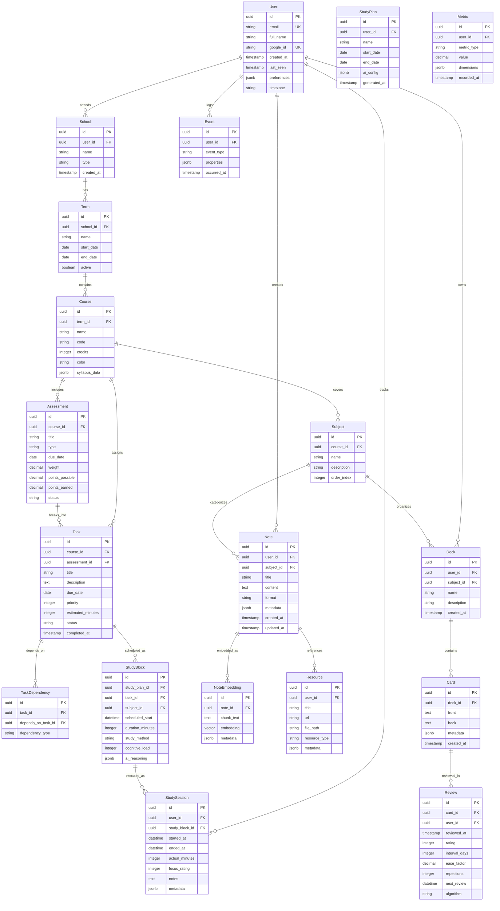

# Entity Relationship Diagram

## Purpose
Define the complete data model for StudySharper with relationships and constraints.

## Scope
All entities, relationships, and key database constraints for multi-tenant system.

## Core ERD

## Key Relationships

### User-Centric Multi-tenancy
- All major entities belong to a user via direct FK or through school/course hierarchy
- RLS policies enforce user isolation at database level

### Academic Hierarchy  
- School → Term → Course → Subject/Assessment
- Flexible enough for various educational systems

### Task Management
- Tasks can be standalone or linked to assessments
- Dependency graph supports prerequisite modeling
- Study blocks are AI-generated scheduling of tasks

### Spaced Repetition
- Cards grouped in decks by subject
- Reviews track SRS algorithm state (SM-2 initially, FSRS later)
- Separate from notes but can be generated from them

### AI Integration
- Note embeddings for RAG and semantic search
- Study plans store AI reasoning for explainability
- Metrics and events feed recommendation engine

## Acceptance Criteria
- [ ] All entities have appropriate indexes
- [ ] Foreign key constraints properly defined
- [ ] RLS policies cover all user data
- [ ] Supports 10,000+ users without performance degradation
- [ ] Migration scripts handle schema evolution

## Open Questions
None - ERD covers all requirements.

## Done means...
Complete data model implemented in Supabase with all constraints, indexes, and RLS policies.