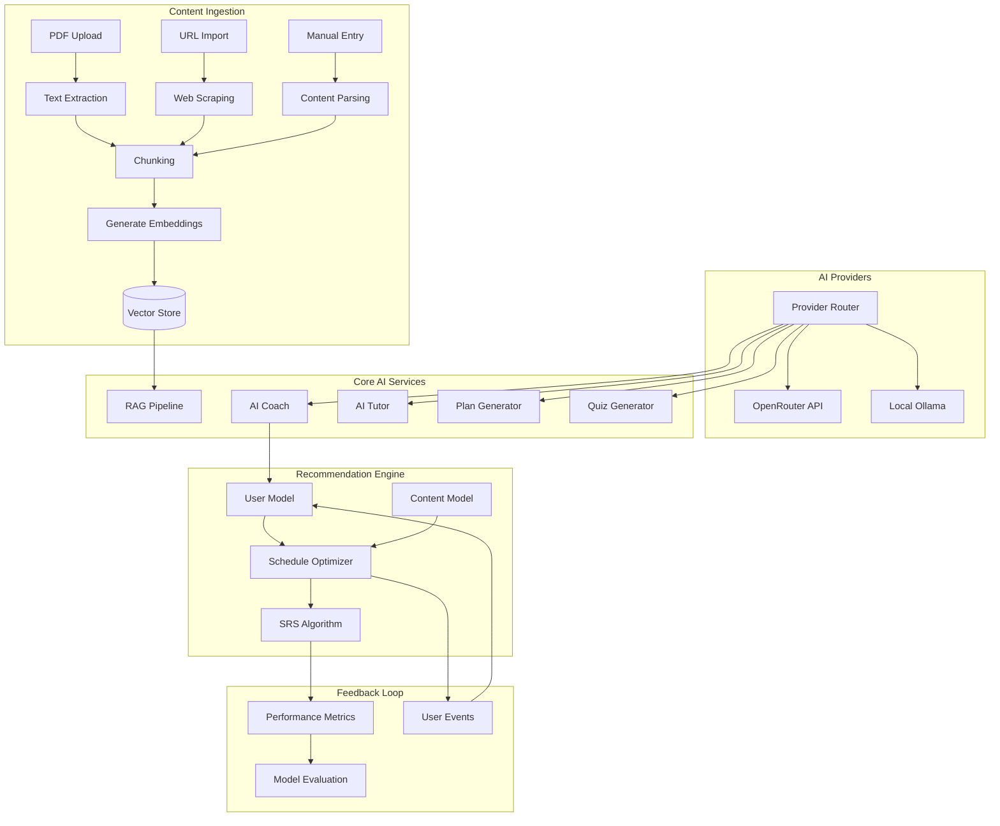

# AI Architecture

## Purpose
Define the complete AI system architecture for StudySharper including RAG, embeddings, and recommendation engine.

## Scope
All AI components: content processing, retrieval, generation, personalization, and evaluation.

## Architecture Overview



## Components

### 1. Content Ingestion Pipeline
**Input**: PDFs, URLs, manual text, syllabus files
**Processing**: 
- Text extraction (PyPDF2, BeautifulSoup)
- Intelligent chunking (semantic boundaries, max 512 tokens)
- Metadata extraction (source, date, type, course)
**Output**: Structured chunks with embeddings in pgvector

**Chunking Strategy**:
- Preserve paragraph boundaries
- Split on headers and section breaks
- Overlap 50 tokens between chunks
- Max 512 tokens per chunk (embedding model limit)

### 2. AI Provider Abstraction
**Interface**:
```typescript
interface AIProvider {
  chat(messages: Message[], options?: ChatOptions): Promise<ChatResponse>
  embed(texts: string[]): Promise<number[][]>
  isAvailable(): Promise<boolean>
  getCost(tokens: number): number
}
```

**Providers**:
- **OpenRouter**: Primary, pay-per-use, high quality
- **Ollama**: Fallback, local, free, lower quality but private

**Failover Logic**:
1. Try OpenRouter if API key present and under daily budget
2. Fall back to Ollama if available locally
3. Graceful degradation with cached responses

### 3. RAG Pipeline
**Query Processing**:
1. Extract intent and entities from user query
2. Generate embedding for semantic search
3. Retrieve top-k relevant chunks (k=5-10)
4. Re-rank by relevance and recency
5. Generate response with context and citations

**Retrieval Strategy**:
- Hybrid search: semantic similarity + keyword matching
- User context filtering (course, subject, recency)
- Diversity injection to avoid echo chambers

### 4. AI Coach System
**Purpose**: Generate personalized study plans and recommendations

**Inputs**:
- User's course schedule and deadlines
- Historical performance data
- Current knowledge state (SRS data)
- Available time slots from calendar
- Learning preferences and goals

**Processing**:
- Cognitive load calculation per time slot
- Interleaving optimization across subjects
- Spaced repetition scheduling
- Deadline pressure modeling

**Output**: 7-day rolling study plan with reasoning

### 5. Recommendation Engine
**User Model Features**:
- Study time preferences (morning/evening)
- Subject difficulty ratings (self-reported + performance)
- Forgetting curves per topic
- Procrastination patterns
- Optimal session lengths

**Objective Function**:
Maximize: Long-term retention × Schedule adherence
Minimize: Cognitive overload + Deadline stress

**Constraints**:
- Available time slots from calendar
- Maximum daily study hours
- Minimum spacing between related topics
- Assessment deadlines

### 6. Spaced Repetition System
**Algorithm Evolution**:
- Phase 1: SM-2 (simple, proven)
- Phase 2: FSRS (modern, more accurate)

**Integration**:
- Cards generated from notes automatically
- Review scheduling integrated with study plans
- Performance feeds back to user model

## Data Flow

### Study Plan Generation
1. User requests new plan or system triggers nightly update
2. Fetch user context: courses, deadlines, calendar, preferences
3. Query RAG for relevant study strategies and content
4. Generate plan using AI coach with reasoning
5. Store plan with confidence scores and alternatives
6. Present to user with explanations

### Content Q&A
1. User asks question about their notes/materials
2. Generate query embedding
3. Retrieve relevant chunks from user's content
4. Generate response with AI tutor persona
5. Track interaction for user model update

### Performance Tracking
1. User completes study session or review
2. Log performance metrics (accuracy, time, difficulty)
3. Update user model and forgetting curves
4. Trigger plan re-optimization if significant change

## Quality Assurance

### Guardrails
- Content filtering for inappropriate material
- Fact-checking against multiple sources
- Confidence thresholds for AI responses
- Human oversight for critical recommendations

### Evaluation Framework
- Retention improvement vs control group
- Study time efficiency metrics
- User satisfaction scores
- Plan adherence rates

### A/B Testing
- Different prompting strategies
- Model comparison (Claude vs GPT vs local)
- Recommendation algorithm variants
- UI/UX for AI interactions

## Privacy & Security
- All user data encrypted at rest and in transit
- Local processing option via Ollama
- No training on user data
- Clear data retention and deletion policies

## Acceptance Criteria
- [ ] RAG pipeline retrieves relevant content with >80% accuracy
- [ ] Study plans improve retention by >25% vs control
- [ ] AI responses have <5% hallucination rate
- [ ] System handles 1000+ concurrent users
- [ ] Average response time <2 seconds
- [ ] Fallback to local models works seamlessly

## Open Questions
None - architecture covers all AI requirements.

## Done means...
Complete AI system implemented with all components integrated and tested.