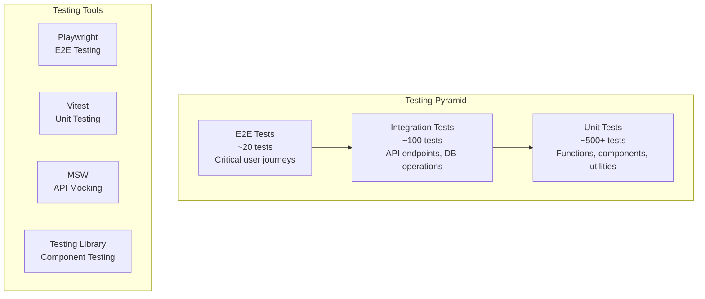

# Testing Strategy

---
id: testing-strategy
owner: engineering-team
status: active
last_updated: 2025-08-12
links:
  - "[Stack Decision](../02-decisions/stack.md)"
  - "[Feature Inventory](../05-product/feature-inventory.md)"
  - "[RLS Policies](../07-rls/policies.md)"
  - "[AI Architecture](../08-ai/architecture.md)"
---

## Purpose
Define comprehensive testing strategy for StudySharper to ensure reliable, secure, and performant AI-powered study platform with high confidence in deployments.

## Scope
All testing methodologies from unit tests through production monitoring, covering frontend, backend, AI systems, security, performance, and user experience validation.

## Testing Philosophy

### Core Principles
1. **Risk-Based Testing**: Focus on critical user journeys and high-risk areas
2. **Shift-Left Approach**: Catch issues as early as possible in development
3. **Test Pyramid**: Many unit tests, fewer integration tests, minimal E2E tests
4. **Continuous Testing**: Automated testing integrated into CI/CD pipeline
5. **User-Centric**: Test from user perspective, not just technical correctness

### Quality Gates
- **Unit Test Coverage**: >90% for core business logic
- **Integration Test Coverage**: >80% for API endpoints
- **E2E Test Coverage**: 100% of critical user paths
- **Security Test Coverage**: 100% of authentication and authorization flows
- **Performance Benchmarks**: All tests must pass defined SLAs

## Testing Pyramid



## Unit Testing Strategy

### Frontend Unit Tests (Vitest + Testing Library)

#### Component Testing
```typescript
// Example: StudyCard component test
import { render, screen, fireEvent } from '@testing-library/react'
import { StudyCard } from '@/components/study-card'

describe('StudyCard', () => {
  const mockProps = {
    subject: 'Binary Trees',
    duration: 25,
    method: 'Active Practice',
    difficulty: 'Medium',
    onStart: vi.fn(),
    onSkip: vi.fn(),
  }

  it('renders study card with correct information', () => {
    render(<StudyCard {...mockProps} />)
    
    expect(screen.getByText('Binary Trees')).toBeInTheDocument()
    expect(screen.getByText('25 min')).toBeInTheDocument()
    expect(screen.getByText('Active Practice')).toBeInTheDocument()
    expect(screen.getByText('Medium')).toBeInTheDocument()
  })

  it('calls onStart when start button is clicked', () => {
    render(<StudyCard {...mockProps} />)
    
    fireEvent.click(screen.getByRole('button', { name: /start session/i }))
    
    expect(mockProps.onStart).toHaveBeenCalledTimes(1)
  })

  it('displays progress indicator for in-progress sessions', () => {
    render(<StudyCard {...mockProps} status="in-progress" />)
    
    expect(screen.getByRole('progressbar')).toBeInTheDocument()
  })
})
```

#### Hook Testing
```typescript
// Example: useStudyPlan hook test
import { renderHook, act } from '@testing-library/react'
import { useStudyPlan } from '@/hooks/use-study-plan'

describe('useStudyPlan', () => {
  it('generates study plan for user courses', async () => {
    const { result } = renderHook(() => useStudyPlan())
    
    await act(async () => {
      await result.current.generatePlan({
        courses: mockCourses,
        timeSlots: mockTimeSlots,
        preferences: mockPreferences
      })
    })
    
    expect(result.current.plan).toBeDefined()
    expect(result.current.plan.blocks).toHaveLength(7) // 7-day plan
    expect(result.current.isLoading).toBe(false)
  })

  it('handles API errors gracefully', async () => {
    const { result } = renderHook(() => useStudyPlan())
    
    // Mock API failure
    vi.mocked(generateStudyPlan).mockRejectedValue(new Error('API Error'))
    
    await act(async () => {
      await result.current.generatePlan(mockData)
    })
    
    expect(result.current.error).toBe('Failed to generate study plan')
    expect(result.current.plan).toBeNull()
  })
})
```

#### Utility Function Testing
```typescript
// Example: Spaced repetition algorithm test
import { calculateNextReview, sm2Algorithm } from '@/lib/spaced-repetition'

describe('spaced repetition algorithms', () => {
  describe('SM-2 Algorithm', () => {
    it('calculates correct intervals for different ratings', () => {
      const card = { repetitions: 0, interval: 1, easeFactor: 2.5 }
      
      // Rating 3 (correct with difficulty)
      const result3 = sm2Algorithm(card, 3)
      expect(result3.interval).toBe(1)
      expect(result3.repetitions).toBe(1)
      
      // Rating 5 (perfect recall)
      const result5 = sm2Algorithm(card, 5)
      expect(result5.interval).toBe(6)
      expect(result5.easeFactor).toBeGreaterThan(2.5)
    })

    it('resets repetitions for failed cards', () => {
      const card = { repetitions: 3, interval: 15, easeFactor: 2.5 }
      
      const result = sm2Algorithm(card, 1) // Failed
      
      expect(result.repetitions).toBe(0)
      expect(result.interval).toBe(1)
    })
  })
})
```

### Backend Unit Tests (Vitest)

#### API Route Testing
```typescript
// Example: Study plan API test
import { POST } from '@/app/api/study-plans/route'
import { createMocks } from 'node-mocks-http'

describe('/api/study-plans', () => {
  it('generates study plan for authenticated user', async () => {
    const { req, res } = createMocks({
      method: 'POST',
      headers: { authorization: 'Bearer valid-token' },
      body: {
        courses: ['course-1', 'course-2'],
        timeSlots: mockTimeSlots,
        preferences: mockPreferences
      }
    })

    const response = await POST(req)
    const data = await response.json()
    
    expect(response.status).toBe(200)
    expect(data.plan).toBeDefined()
    expect(data.plan.blocks).toHaveLength(7)
  })

  it('returns 401 for unauthenticated requests', async () => {
    const { req } = createMocks({
      method: 'POST',
      body: mockData
    })

    const response = await POST(req)
    
    expect(response.status).toBe(401)
  })
})
```

#### Service Layer Testing
```typescript
// Example: AI service test
import { AIService } from '@/lib/ai-service'
import { MockAIProvider } from '@/lib/ai-providers/mock'

describe('AIService', () => {
  let aiService: AIService

  beforeEach(() => {
    aiService = new AIService(new MockAIProvider())
  })

  it('generates study plan with AI reasoning', async () => {
    const plan = await aiService.generateStudyPlan({
      courses: mockCourses,
      deadlines: mockDeadlines,
      userHistory: mockHistory
    })
    
    expect(plan.blocks).toBeDefined()
    expect(plan.reasoning).toContain('cognitive load')
    expect(plan.blocks.every(block => block.duration <= 90)).toBe(true)
  })

  it('handles AI provider failures gracefully', async () => {
    const failingProvider = new MockAIProvider()
    failingProvider.chat = vi.fn().mockRejectedValue(new Error('AI Error'))
    
    const service = new AIService(failingProvider)
    
    await expect(
      service.generateStudyPlan(mockData)
    ).rejects.toThrow('Failed to generate study plan')
  })
})
```

## Integration Testing Strategy

### Database Integration Tests
```typescript
// Example: Course CRUD operations test
import { createClient } from '@/lib/supabase/server'
import { TestDatabase } from '@/test-utils/database'

describe('Course Operations', () => {
  let testDb: TestDatabase
  let supabase: ReturnType<typeof createClient>

  beforeEach(async () => {
    testDb = new TestDatabase()
    await testDb.setup()
    supabase = createClient()
  })

  afterEach(async () => {
    await testDb.cleanup()
  })

  it('creates course with proper RLS isolation', async () => {
    const user1 = await testDb.createUser('user1@test.com')
    const user2 = await testDb.createUser('user2@test.com')
    
    // User 1 creates course
    await supabase.auth.setSession(user1.session)
    const { data: course } = await supabase
      .from('courses')
      .insert({ name: 'CS 101', term_id: user1.termId })
      .select()
      .single()
    
    // User 2 cannot see user 1's course
    await supabase.auth.setSession(user2.session)
    const { data: courses } = await supabase
      .from('courses')
      .select()
    
    expect(courses).toHaveLength(0)
    expect(course.name).toBe('CS 101')
  })
})
```

### API Integration Tests
```typescript
// Example: Study session flow test
describe('Study Session API Flow', () => {
  it('completes full study session lifecycle', async () => {
    const user = await testDb.createUser()
    const course = await testDb.createCourse(user.id)
    
    // Start session
    const startResponse = await request(app)
      .post('/api/study-sessions')
      .set('Authorization', `Bearer ${user.token}`)
      .send({
        courseId: course.id,
        method: 'active-practice',
        estimatedMinutes: 25
      })
    
    expect(startResponse.status).toBe(201)
    const sessionId = startResponse.body.id
    
    // Update progress
    const updateResponse = await request(app)
      .patch(`/api/study-sessions/${sessionId}`)
      .set('Authorization', `Bearer ${user.token}`)
      .send({
        focusRating: 4,
        notes: 'Good session on binary trees'
      })
    
    expect(updateResponse.status).toBe(200)
    
    // Complete session
    const completeResponse = await request(app)
      .post(`/api/study-sessions/${sessionId}/complete`)
      .set('Authorization', `Bearer ${user.token}`)
      .send({
        actualMinutes: 28,
        completionRating: 5
      })
    
    expect(completeResponse.status).toBe(200)
    expect(completeResponse.body.status).toBe('completed')
  })
})
```

### AI Integration Tests
```typescript
// Example: RAG pipeline test
describe('RAG Pipeline Integration', () => {
  it('retrieves relevant content for user queries', async () => {
    const user = await testDb.createUser()
    const note = await testDb.createNote(user.id, {
      title: 'Binary Search Trees',
      content: 'A binary search tree is a data structure...'
    })
    
    // Generate embeddings
    await generateEmbeddings(note.id)
    
    // Query RAG system
    const response = await request(app)
      .post('/api/chat')
      .set('Authorization', `Bearer ${user.token}`)
      .send({
        message: 'What is a binary search tree?',
        context: 'study-help'
      })
    
    expect(response.status).toBe(200)
    expect(response.body.answer).toContain('binary search tree')
    expect(response.body.sources).toContain(note.id)
    expect(response.body.confidence).toBeGreaterThan(0.8)
  })
})
```

## End-to-End Testing Strategy

### Critical User Journeys (Playwright)
```typescript
// Example: Complete study workflow E2E test
import { test, expect } from '@playwright/test'

test.describe('Study Workflow', () => {
  test('user can complete full study cycle', async ({ page }) => {
    // Login
    await page.goto('/login')
    await page.click('text=Continue with Google')
    await page.fill('[data-testid=email]', 'test@example.com')
    await page.fill('[data-testid=password]', 'password123')
    await page.click('[data-testid=login-button]')
    
    // Create course
    await page.goto('/courses')
    await page.click('text=Add Course')
    await page.fill('[data-testid=course-name]', 'CS 101')
    await page.fill('[data-testid=course-code]', 'CS101')
    await page.click('[data-testid=save-course]')
    
    // Upload content
    await page.click('text=Upload Materials')
    await page.setInputFiles('[data-testid=file-upload]', 'test-syllabus.pdf')
    await page.click('[data-testid=upload-button]')
    await page.waitForSelector('text=Upload successful')
    
    // Generate study plan
    await page.goto('/study-plan')
    await page.click('[data-testid=generate-plan]')
    await page.waitForSelector('[data-testid=study-block]')
    
    // Start study session
    await page.click('[data-testid=start-session]')
    await page.waitForSelector('[data-testid=session-timer]')
    
    // Complete session
    await page.click('[data-testid=complete-session]')
    await page.fill('[data-testid=focus-rating]', '4')
    await page.fill('[data-testid=session-notes]', 'Great session!')
    await page.click('[data-testid=save-session]')
    
    // Verify completion
    await expect(page.locator('text=Session completed')).toBeVisible()
    await expect(page.locator('[data-testid=session-count]')).toContainText('1')
  })
})
```

### Mobile E2E Tests
```typescript
test.describe('Mobile Experience', () => {
  test.use({ 
    viewport: { width: 375, height: 667 }, // iPhone SE
    hasTouch: true 
  })

  test('mobile study session works correctly', async ({ page }) => {
    await page.goto('/study-plan')
    
    // Test swipe gestures
    await page.locator('[data-testid=study-card]').swipe('right')
    await expect(page.locator('text=Session started')).toBeVisible()
    
    // Test bottom navigation
    await page.click('[data-testid=bottom-nav-dashboard]')
    await expect(page).toHaveURL('/dashboard')
    
    // Test responsive layout
    await expect(page.locator('[data-testid=sidebar]')).not.toBeVisible()
    await expect(page.locator('[data-testid=mobile-menu]')).toBeVisible()
  })
})
```

### Performance E2E Tests
```typescript
test.describe('Performance', () => {
  test('app loads within performance budgets', async ({ page }) => {
    await page.goto('/dashboard')
    
    // Measure Core Web Vitals
    const vitals = await page.evaluate(() => {
      return new Promise((resolve) => {
        new PerformanceObserver((list) => {
          const entries = list.getEntries()
          resolve({
            lcp: entries.find(e => e.entryType === 'largest-contentful-paint'),
            fid: entries.find(e => e.entryType === 'first-input'),
            cls: entries.find(e => e.entryType === 'layout-shift')
          })
        }).observe({ entryTypes: ['largest-contentful-paint', 'first-input', 'layout-shift'] })
      })
    })
    
    expect(vitals.lcp.value).toBeLessThan(2500) // 2.5s
    expect(vitals.fid.value).toBeLessThan(100)  // 100ms
    expect(vitals.cls.value).toBeLessThan(0.1)  // 0.1
  })
})
```

## Security Testing Strategy

### Authentication & Authorization Tests
```typescript
describe('Security Tests', () => {
  it('prevents unauthorized access to user data', async () => {
    const user1 = await testDb.createUser('user1@test.com')
    const user2 = await testDb.createUser('user2@test.com')
    
    const user1Note = await testDb.createNote(user1.id, { title: 'Secret Note' })
    
    // User 2 cannot access user 1's note
    const response = await request(app)
      .get(`/api/notes/${user1Note.id}`)
      .set('Authorization', `Bearer ${user2.token}`)
    
    expect(response.status).toBe(404) // Not found due to RLS
  })

  it('validates JWT tokens properly', async () => {
    const response = await request(app)
      .get('/api/courses')
      .set('Authorization', 'Bearer invalid-token')
    
    expect(response.status).toBe(401)
  })

  it('prevents SQL injection in search queries', async () => {
    const user = await testDb.createUser()
    
    const response = await request(app)
      .get('/api/search')
      .query({ q: "'; DROP TABLE users; --" })
      .set('Authorization', `Bearer ${user.token}`)
    
    expect(response.status).toBe(400)
    expect(response.body.error).toContain('Invalid search query')
  })
})
```

### Content Security Tests
```typescript
describe('Content Security', () => {
  it('sanitizes user input in notes', async () => {
    const user = await testDb.createUser()
    
    const response = await request(app)
      .post('/api/notes')
      .set('Authorization', `Bearer ${user.token}`)
      .send({
        title: 'Test Note',
        content: '<script>alert("XSS")</script>Safe content'
      })
    
    expect(response.status).toBe(201)
    expect(response.body.content).not.toContain('<script>')
    expect(response.body.content).toContain('Safe content')
  })

  it('validates file uploads', async () => {
    const user = await testDb.createUser()
    
    const response = await request(app)
      .post('/api/upload')
      .set('Authorization', `Bearer ${user.token}`)
      .attach('file', Buffer.from('malicious content'), 'virus.exe')
    
    expect(response.status).toBe(400)
    expect(response.body.error).toContain('Invalid file type')
  })
})
```

## AI Testing Strategy

### AI Provider Testing
```typescript
describe('AI Provider Failover', () => {
  it('falls back to Ollama when OpenRouter fails', async () => {
    const mockOpenRouter = new MockOpenRouter()
    mockOpenRouter.chat = vi.fn().mockRejectedValue(new Error('Rate limit'))
    
    const mockOllama = new MockOllama()
    mockOllama.chat = vi.fn().mockResolvedValue('Fallback response')
    
    const aiService = new AIService({
      primary: mockOpenRouter,
      fallback: mockOllama
    })
    
    const response = await aiService.chat('Test question')
    
    expect(mockOpenRouter.chat).toHaveBeenCalled()
    expect(mockOllama.chat).toHaveBeenCalled()
    expect(response).toBe('Fallback response')
  })
})
```

### RAG Quality Testing
```typescript
describe('RAG Quality', () => {
  it('retrieves relevant context for queries', async () => {
    const testQueries = [
      { query: 'What is a binary tree?', expectedConcepts: ['binary', 'tree', 'node'] },
      { query: 'How does merge sort work?', expectedConcepts: ['merge', 'sort', 'divide'] }
    ]
    
    for (const { query, expectedConcepts } of testQueries) {
      const context = await ragPipeline.retrieveContext(query)
      
      expect(context.chunks.length).toBeGreaterThan(0)
      expect(context.relevanceScore).toBeGreaterThan(0.7)
      
      const contextText = context.chunks.join(' ').toLowerCase()
      expectedConcepts.forEach(concept => {
        expect(contextText).toContain(concept)
      })
    }
  })
})
```

## Performance Testing

### Load Testing (Artillery.js)
```yaml
# artillery-config.yml
config:
  target: 'http://localhost:3000'
  phases:
    - duration: 60
      arrivalRate: 10
    - duration: 120
      arrivalRate: 50
    - duration: 60
      arrivalRate: 100

scenarios:
  - name: "Study session workflow"
    weight: 70
    flow:
      - post:
          url: "/api/auth/login"
          json:
            email: "test@example.com"
            password: "password123"
      - get:
          url: "/api/study-plans"
      - post:
          url: "/api/study-sessions"
          json:
            courseId: "{{ courseId }}"
            method: "review"

  - name: "AI chat queries"
    weight: 30
    flow:
      - post:
          url: "/api/chat"
          json:
            message: "What is {{ concept }}?"
            context: "study-help"
```

### Database Performance Tests
```typescript
describe('Database Performance', () => {
  it('handles concurrent user operations', async () => {
    const users = await Promise.all(
      Array.from({ length: 100 }, () => testDb.createUser())
    )
    
    const startTime = Date.now()
    
    // Simulate concurrent study sessions
    await Promise.all(
      users.map(user => 
        request(app)
          .post('/api/study-sessions')
          .set('Authorization', `Bearer ${user.token}`)
          .send({ courseId: user.courseId, method: 'review' })
      )
    )
    
    const duration = Date.now() - startTime
    expect(duration).toBeLessThan(5000) // 5 seconds
  })
})
```

## Test Data Management

### Test Database Setup
```typescript
export class TestDatabase {
  private supabase: SupabaseClient

  async setup() {
    // Create isolated test schema
    await this.supabase.rpc('create_test_schema')
    
    // Run migrations on test schema
    await this.runMigrations()
    
    // Seed test data
    await this.seedTestData()
  }

  async createUser(email = 'test@example.com') {
    const { data: user } = await this.supabase.auth.signUp({
      email,
      password: 'password123'
    })
    
    const school = await this.createSchool(user.id)
    const term = await this.createTerm(school.id)
    const course = await this.createCourse(term.id)
    
    return { ...user, school, term, course }
  }

  async cleanup() {
    await this.supabase.rpc('drop_test_schema')
  }
}
```

### Mock Data Factories
```typescript
export const mockDataFactory = {
  user: (overrides = {}) => ({
    id: faker.string.uuid(),
    email: faker.internet.email(),
    fullName: faker.person.fullName(),
    timezone: 'America/New_York',
    preferences: {
      studyTime: 'morning',
      sessionLength: 25,
      difficulty: 'medium'
    },
    ...overrides
  }),

  course: (overrides = {}) => ({
    id: faker.string.uuid(),
    name: faker.lorem.words(2),
    code: faker.string.alphanumeric(6).toUpperCase(),
    credits: faker.number.int({ min: 1, max: 4 }),
    color: faker.color.hex(),
    ...overrides
  }),

  studyBlock: (overrides = {}) => ({
    id: faker.string.uuid(),
    scheduledStart: faker.date.future(),
    durationMinutes: faker.helpers.arrayElement([25, 45, 60]),
    studyMethod: faker.helpers.arrayElement(['review', 'practice', 'read']),
    cognitiveLoad: faker.number.int({ min: 1, max: 5 }),
    ...overrides
  })
}
```

## Continuous Integration

### GitHub Actions Workflow
```yaml
name: Test Suite

on: [push, pull_request]

jobs:
  unit-tests:
    runs-on: ubuntu-latest
    steps:
      - uses: actions/checkout@v4
      - uses: actions/setup-node@v4
        with:
          node-version: '20'
      - run: npm ci
      - run: npm run test:unit
      - run: npm run test:coverage

  integration-tests:
    runs-on: ubuntu-latest
    services:
      postgres:
        image: postgres:15
        env:
          POSTGRES_PASSWORD: postgres
        options: >-
          --health-cmd pg_isready
          --health-interval 10s
          --health-timeout 5s
          --health-retries 5
    steps:
      - uses: actions/checkout@v4
      - run: npm ci
      - run: npm run test:integration

  e2e-tests:
    runs-on: ubuntu-latest
    steps:
      - uses: actions/checkout@v4
      - run: npm ci
      - run: npx playwright install
      - run: npm run test:e2e

  security-tests:
    runs-on: ubuntu-latest
    steps:
      - uses: actions/checkout@v4
      - run: npm audit
      - run: npm run test:security
      - uses: github/codeql-action/analyze@v2
```

## Test Reporting & Monitoring

### Coverage Reports
```typescript
// vitest.config.ts
export default defineConfig({
  test: {
    coverage: {
      provider: 'v8',
      reporter: ['text', 'json', 'html'],
      thresholds: {
        global: {
          branches: 80,
          functions: 90,
          lines: 90,
          statements: 90
        }
      }
    }
  }
})
```

### Test Metrics Dashboard
- **Test Execution Time**: Track test suite performance
- **Flaky Test Detection**: Identify unreliable tests
- **Coverage Trends**: Monitor code coverage over time
- **Failure Analysis**: Categorize and track test failures

## Acceptance Criteria
- [ ] Unit test coverage >90% for core business logic
- [ ] Integration test coverage >80% for API endpoints
- [ ] All critical user journeys covered by E2E tests
- [ ] Security tests verify complete data isolation
- [ ] Performance tests validate SLA compliance
- [ ] AI quality tests ensure accurate responses
- [ ] Mobile testing covers responsive behavior
- [ ] CI/CD pipeline runs all tests automatically

## Risks
- **Test Maintenance Overhead**: Large test suite requires ongoing maintenance
- **Flaky Tests**: AI and async operations may cause intermittent failures
- **Test Data Management**: Complex test data setup and cleanup
- **Performance Test Environment**: Matching production load conditions

## Open Questions
- Should we implement visual regression testing for UI components?
- How to test AI model quality degradation over time?
- What level of browser compatibility testing is needed?

## Done means...
Comprehensive testing strategy implemented with high confidence in code quality, security, and performance across all StudySharper features and user journeys.