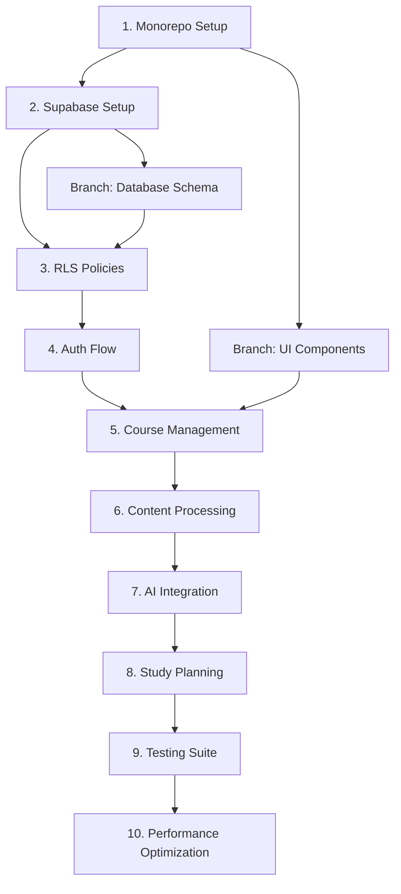

# Next Steps: Concrete Implementation Plan

---
id: next-steps-plan
owner: autonomous-team
status: active
last_updated: 2025-08-12
links:
  - "[Workplan](./workplan.md)"
  - "[Feature Inventory](../05-product/feature-inventory.md)"
  - "[Testing Strategy](../12-testing/strategy.md)"
  - "[Stack Decision](../02-decisions/stack.md)"
---

## Purpose
Define the next 10 concrete, actionable development tasks with clear dependencies, acceptance criteria, and implementation guidance for autonomous AI development of StudySharper.

## Scope
Immediate next steps covering infrastructure setup, core feature implementation, and quality assurance to achieve a functional MVP within the next development cycle.

## Task Dependency Graph



## Task 1: Monorepo Infrastructure Setup

### Description
Set up complete monorepo structure with proper tooling, linting, and build configuration.

### Dependencies
- None (foundation task)

### Implementation Steps
```bash
# 1. Initialize monorepo structure
mkdir -p apps/web packages/ui packages/database packages/ai
mkdir -p tools/scripts tools/config

# 2. Setup package.json with workspaces
npm init -w apps/web -w packages/ui -w packages/database -w packages/ai

# 3. Configure TypeScript project references
# Create tsconfig.json with project references
# Setup path mapping for internal packages

# 4. Setup build tooling
npm install -D turbo @turbo/gen
npx turbo gen workspace

# 5. Configure linting and formatting
npm install -D eslint prettier @typescript-eslint/parser
echo "extends: ['@repo/eslint-config']" > apps/web/.eslintrc.js
```

### File Structure
```
studysharper/
├── apps/
│   └── web/                 # Next.js application
├── packages/
│   ├── ui/                  # Shared UI components
│   ├── database/            # Database utilities and types
│   ├── ai/                  # AI provider abstractions
│   └── config/              # Shared configuration
├── tools/
│   ├── scripts/             # Development scripts
│   └── config/              # Tool configurations
├── turbo.json              # Turbo configuration
├── package.json            # Root package.json
└── tsconfig.json           # Root TypeScript config
```

### Acceptance Criteria
- [ ] Turbo builds all packages successfully
- [ ] TypeScript compilation works across packages
- [ ] ESLint and Prettier run without errors
- [ ] Hot reload works in development
- [ ] Package dependencies resolve correctly

### Estimated Time
2-3 hours

---

## Task 2: Supabase Project Setup & Configuration

### Description
Initialize Supabase project with local development environment and CI/CD integration.

### Dependencies
- Task 1 (Monorepo Setup)

### Implementation Steps
```bash
# 1. Initialize Supabase project
npx supabase init
npx supabase start

# 2. Configure environment variables
cp .env.example .env.local
# Add SUPABASE_URL, SUPABASE_ANON_KEY, SUPABASE_SERVICE_ROLE_KEY

# 3. Setup database configuration
# Create supabase/config.toml with project settings
# Configure auth providers (Google OAuth)

# 4. Setup migration structure
mkdir -p supabase/migrations/
mkdir -p supabase/seeds/

# 5. Create development utilities
echo "export * from './client'" > packages/database/index.ts
```

### Configuration Files
```toml
# supabase/config.toml
[auth]
enabled = true
external_google_enabled = true

[auth.external.google]
enabled = true
client_id = "env(GOOGLE_CLIENT_ID)"
secret = "env(GOOGLE_CLIENT_SECRET)"

[db]
major_version = 15
```

### Acceptance Criteria
- [ ] Supabase local instance runs successfully
- [ ] Environment variables configured correctly
- [ ] Google OAuth provider configured
- [ ] Database connection established
- [ ] Migration system functional

### Estimated Time
1-2 hours

---

## Task 3: Complete Database Schema & RLS Implementation

### Description
Implement full database schema from ERD with all tables, relationships, indexes, and Row Level Security policies.

### Dependencies
- Task 2 (Supabase Setup)

### Implementation Steps
```sql
-- 1. Create core tables migration
-- File: supabase/migrations/001_core_schema.sql

-- Users table (handled by Supabase Auth)
-- Schools, Terms, Courses, Subjects tables

-- 2. Create study system tables migration  
-- File: supabase/migrations/002_study_system.sql
-- StudyPlans, StudyBlocks, StudySessions, Tasks tables

-- 3. Create content tables migration
-- File: supabase/migrations/003_content_system.sql  
-- Notes, NoteEmbeddings, Resources tables

-- 4. Create spaced repetition tables migration
-- File: supabase/migrations/004_spaced_repetition.sql
-- Decks, Cards, Reviews tables

-- 5. Create analytics tables migration
-- File: supabase/migrations/005_analytics.sql
-- Metrics, Events tables

-- 6. Create indexes migration
-- File: supabase/migrations/006_indexes.sql
-- Performance indexes for common queries

-- 7. Create RLS policies migration
-- File: supabase/migrations/007_rls_policies.sql
-- Complete RLS implementation from policies.md
```

### Key Tables to Implement
1. **users** (Supabase Auth extended)
2. **schools** → **terms** → **courses** → **subjects**
3. **assessments** → **tasks** → **task_dependencies**
4. **study_plans** → **study_blocks** → **study_sessions**
5. **notes** → **note_embeddings**
6. **decks** → **cards** → **reviews**
7. **metrics**, **events**, **resources**

### Acceptance Criteria
- [ ] All ERD tables created with correct schema
- [ ] Foreign key constraints properly defined
- [ ] RLS policies prevent cross-user data access
- [ ] Indexes support efficient queries
- [ ] Sample seed data loads successfully
- [ ] TypeScript types generated from schema

### Estimated Time
4-5 hours

---

## Task 4: Authentication Flow Implementation

### Description
Implement complete authentication flow with Google OAuth, session management, and user onboarding.

### Dependencies
- Task 3 (Database Schema)

### Implementation Steps
```typescript
// 1. Create auth utilities
// File: packages/database/auth.ts
export const createClient = () => createBrowserClient(...)
export const createServerClient = () => createServerActionClient(...)

// 2. Implement auth components
// File: apps/web/components/auth/login-form.tsx
// Google OAuth button with proper styling

// 3. Create auth pages
// File: apps/web/app/(auth)/login/page.tsx
// File: apps/web/app/(auth)/signup/page.tsx
// File: apps/web/app/(auth)/callback/route.ts

// 4. Implement middleware
// File: apps/web/middleware.ts
// Protected route handling

// 5. Create user onboarding
// File: apps/web/app/(auth)/onboarding/page.tsx
// School/timezone setup
```

### Component Structure
```typescript
// Auth provider context
export const AuthProvider = ({ children }) => {
  const [user, setUser] = useState(null)
  const [loading, setLoading] = useState(true)
  
  useEffect(() => {
    const { data: { subscription } } = supabase.auth.onAuthStateChange(
      (event, session) => {
        setUser(session?.user ?? null)
        setLoading(false)
      }
    )
    return () => subscription.unsubscribe()
  }, [])
  
  return (
    <AuthContext.Provider value={{ user, loading }}>
      {children}
    </AuthContext.Provider>
  )
}
```

### Acceptance Criteria
- [ ] Google OAuth login/signup works end-to-end
- [ ] Session persistence across browser refresh
- [ ] Protected routes redirect to login
- [ ] User profile created in database
- [ ] Onboarding flow collects required data
- [ ] Logout clears session properly

### Estimated Time
3-4 hours

---

## Task 5: Course Management System

### Description
Build complete course management interface for creating and organizing academic structure.

### Dependencies
- Task 4 (Authentication Flow)

### Implementation Steps
```typescript
// 1. Create course management pages
// File: apps/web/app/(dashboard)/courses/page.tsx
// Course list with add/edit/delete functionality

// 2. Implement course forms
// File: apps/web/components/courses/course-form.tsx
// Create/edit course with validation

// 3. Build academic hierarchy components
// File: apps/web/components/courses/term-selector.tsx
// File: apps/web/components/courses/subject-list.tsx

// 4. Create course API routes
// File: apps/web/app/api/courses/route.ts
// CRUD operations with RLS validation

// 5. Implement data hooks
// File: apps/web/hooks/use-courses.ts
// React Query integration for course data
```

### Database Operations
```typescript
// Course service
export class CourseService {
  async createCourse(data: CreateCourseData) {
    const { data: course, error } = await supabase
      .from('courses')
      .insert({
        name: data.name,
        code: data.code,
        credits: data.credits,
        term_id: data.termId,
        color: data.color
      })
      .select()
      .single()
    
    if (error) throw error
    return course
  }
  
  async getUserCourses(userId: string) {
    const { data, error } = await supabase
      .from('courses')
      .select(`
        *,
        term:terms(name, start_date, end_date),
        subjects(id, name, description),
        _count:study_sessions(count)
      `)
      .eq('term.school.user_id', userId)
    
    if (error) throw error
    return data
  }
}
```

### Acceptance Criteria
- [ ] Users can create schools, terms, and courses
- [ ] Course list displays with proper filtering
- [ ] Course editing updates database correctly
- [ ] Subject management within courses works
- [ ] Academic hierarchy enforced by UI
- [ ] Course colors and metadata saved properly

### Estimated Time
4-5 hours

---

## Task 6: Content Processing Pipeline

### Description
Implement file upload, text extraction, and content chunking for AI embeddings.

### Dependencies
- Task 5 (Course Management)

### Implementation Steps
```typescript
// 1. Create file upload API
// File: apps/web/app/api/upload/route.ts
// PDF upload with validation and storage

// 2. Implement text extraction
// File: packages/ai/content-processor.ts
// PDF text extraction with metadata

// 3. Build chunking algorithm
// File: packages/ai/text-chunker.ts
// Semantic chunking with overlap

// 4. Create embedding generation
// File: packages/ai/embeddings.ts
// OpenRouter/Ollama integration for embeddings

// 5. Build content management UI
// File: apps/web/components/content/upload-form.tsx
// Drag-and-drop file upload interface
```

### Content Processing Flow
```typescript
export class ContentProcessor {
  async processFile(file: File, courseId: string) {
    // 1. Validate file type and size
    this.validateFile(file)
    
    // 2. Extract text content
    const textContent = await this.extractText(file)
    
    // 3. Create note record
    const note = await this.createNote({
      title: file.name,
      content: textContent,
      courseId,
      format: 'pdf'
    })
    
    // 4. Generate chunks
    const chunks = this.chunkText(textContent)
    
    // 5. Generate embeddings
    const embeddings = await this.generateEmbeddings(chunks)
    
    // 6. Store embeddings
    await this.storeEmbeddings(note.id, chunks, embeddings)
    
    return note
  }
  
  private chunkText(text: string): string[] {
    // Semantic chunking algorithm
    // Max 512 tokens, preserve paragraph boundaries
    // 50 token overlap between chunks
  }
}
```

### Acceptance Criteria
- [ ] PDF upload works with progress indicator
- [ ] Text extraction handles various PDF formats
- [ ] Chunking creates appropriate segments
- [ ] Embeddings generated and stored in pgvector
- [ ] Content appears in notes interface
- [ ] File validation prevents invalid uploads

### Estimated Time
5-6 hours

---

## Task 7: AI Provider Integration & RAG Pipeline

### Description
Implement AI provider abstraction with OpenRouter/Ollama fallback and RAG pipeline for content queries.

### Dependencies
- Task 6 (Content Processing)

### Implementation Steps
```typescript
// 1. Create AI provider interface
// File: packages/ai/providers/interface.ts
// Unified interface for different AI providers

// 2. Implement OpenRouter provider
// File: packages/ai/providers/openrouter.ts
// Claude/GPT integration with rate limiting

// 3. Implement Ollama provider  
// File: packages/ai/providers/ollama.ts
// Local model fallback

// 4. Build provider router
// File: packages/ai/provider-router.ts
// Failover logic and cost tracking

// 5. Create RAG pipeline
// File: packages/ai/rag-pipeline.ts
// Vector search + context retrieval + response generation
```

### AI Provider Architecture
```typescript
interface AIProvider {
  chat(messages: Message[], options?: ChatOptions): Promise<ChatResponse>
  embed(texts: string[]): Promise<number[][]>
  isAvailable(): Promise<boolean>
  getCost(tokens: number): number
}

export class AIProviderRouter {
  constructor(
    private primary: AIProvider,
    private fallback: AIProvider
  ) {}
  
  async chat(messages: Message[]): Promise<ChatResponse> {
    try {
      if (await this.primary.isAvailable()) {
        return await this.primary.chat(messages)
      }
    } catch (error) {
      console.warn('Primary provider failed, falling back:', error)
    }
    
    return await this.fallback.chat(messages)
  }
}
```

### RAG Implementation
```typescript
export class RAGPipeline {
  async query(question: string, userId: string): Promise<RAGResponse> {
    // 1. Generate query embedding
    const queryEmbedding = await this.aiRouter.embed([question])
    
    // 2. Retrieve relevant chunks
    const chunks = await this.retrieveChunks(queryEmbedding[0], userId)
    
    // 3. Rerank and filter
    const context = this.prepareContext(chunks, question)
    
    // 4. Generate response
    const response = await this.aiRouter.chat([
      { role: 'system', content: RAG_SYSTEM_PROMPT },
      { role: 'user', content: `Context: ${context}\n\nQuestion: ${question}` }
    ])
    
    return {
      answer: response.content,
      sources: chunks.map(c => c.noteId),
      confidence: this.calculateConfidence(chunks, response)
    }
  }
}
```

### Acceptance Criteria
- [ ] OpenRouter integration works with API key
- [ ] Ollama fallback activates when primary fails
- [ ] Cost tracking prevents budget overruns
- [ ] Vector search retrieves relevant content
- [ ] RAG responses include source citations
- [ ] Response quality meets minimum threshold

### Estimated Time
6-7 hours

---

## Task 8: AI Study Plan Generation

### Description
Implement AI-powered study plan generation with cognitive load optimization and calendar integration.

### Dependencies
- Task 7 (AI Integration)

### Implementation Steps
```typescript
// 1. Create study plan AI prompts
// File: packages/ai/prompts/study-planning.ts
// Detailed prompts for plan generation

// 2. Implement plan generation logic
// File: packages/ai/study-planner.ts
// AI-powered schedule optimization

// 3. Build calendar integration
// File: apps/web/components/calendar/study-calendar.tsx
// Weekly view with drag-and-drop

// 4. Create study plan API
// File: apps/web/app/api/study-plans/route.ts
// Generate and update plans

// 5. Implement study session tracking
// File: apps/web/components/study/session-tracker.tsx
// Timer, focus rating, completion tracking
```

### Study Plan Generation
```typescript
export class StudyPlanner {
  async generatePlan(input: StudyPlanInput): Promise<StudyPlan> {
    const prompt = this.buildPlanPrompt(input)
    
    const response = await this.aiRouter.chat([
      { role: 'system', content: STUDY_PLANNER_PROMPT },
      { role: 'user', content: prompt }
    ])
    
    const planData = JSON.parse(response.content)
    
    // Validate and optimize plan
    const optimizedPlan = this.optimizePlan(planData, input.constraints)
    
    // Store in database
    return await this.storePlan(optimizedPlan, input.userId)
  }
  
  private buildPlanPrompt(input: StudyPlanInput): string {
    return `
    User Context:
    - Courses: ${input.courses.map(c => c.name).join(', ')}
    - Available time slots: ${input.timeSlots}
    - Upcoming deadlines: ${input.deadlines}
    - Study preferences: ${input.preferences}
    - Performance history: ${input.performanceHistory}
    
    Generate a 7-day study plan that:
    1. Optimizes for spaced repetition
    2. Balances cognitive load throughout the day
    3. Respects deadline priorities
    4. Incorporates user preferences
    5. Includes variety to prevent monotony
    
    Return JSON format with reasoning for each block.
    `
  }
}
```

### Calendar Component
```typescript
export const StudyCalendar = ({ studyPlan, onBlockUpdate }) => {
  const [selectedBlock, setSelectedBlock] = useState(null)
  
  return (
    <div className="grid grid-cols-7 gap-2">
      {studyPlan.blocks.map(block => (
        <StudyBlock
          key={block.id}
          block={block}
          onStart={() => startStudySession(block)}
          onReschedule={(newTime) => onBlockUpdate(block.id, newTime)}
          draggable
        />
      ))}
    </div>
  )
}
```

### Acceptance Criteria
- [ ] AI generates coherent 7-day study plans
- [ ] Plans respect user time constraints
- [ ] Cognitive load optimization visible in schedule
- [ ] Calendar interface allows plan viewing/editing
- [ ] Study sessions can be started from calendar
- [ ] Plan updates save to database correctly

### Estimated Time
6-8 hours

---

## Task 9: Comprehensive Testing Suite Implementation

### Description
Implement full testing pyramid with unit, integration, and E2E tests covering critical user journeys.

### Dependencies
- Task 8 (Study Planning)

### Implementation Steps
```typescript
// 1. Setup testing infrastructure
// File: apps/web/vitest.config.ts
// Configure Vitest with Testing Library

// 2. Create test utilities
// File: apps/web/test-utils/setup.ts
// Database setup, mock factories, test helpers

// 3. Implement unit tests
// File: apps/web/__tests__/components/
// Component tests with comprehensive coverage

// 4. Build integration tests
// File: apps/web/__tests__/api/
// API route testing with database operations

// 5. Create E2E tests
// File: apps/web/e2e/
// Playwright tests for critical user journeys
```

### Test Configuration
```typescript
// vitest.config.ts
export default defineConfig({
  test: {
    environment: 'jsdom',
    setupFiles: ['./test-utils/setup.ts'],
    coverage: {
      provider: 'v8',
      reporter: ['text', 'json', 'html'],
      thresholds: {
        global: {
          branches: 80,
          functions: 90,
          lines: 90,
          statements: 90
        }
      }
    }
  }
})
```

### Critical Test Scenarios
```typescript
// E2E: Complete study workflow
test('user completes full study cycle', async ({ page }) => {
  // 1. Login with Google OAuth
  await loginWithGoogle(page)
  
  // 2. Create course and upload content
  await createCourse(page, 'CS 101')
  await uploadPDF(page, 'test-syllabus.pdf')
  
  // 3. Generate and view study plan
  await generateStudyPlan(page)
  await expect(page.locator('[data-testid=study-block]')).toBeVisible()
  
  // 4. Complete study session
  await startStudySession(page)
  await completeSession(page, { rating: 4, notes: 'Good session' })
  
  // 5. Verify metrics updated
  await expect(page.locator('[data-testid=session-count]')).toContainText('1')
})
```

### Acceptance Criteria
- [ ] Unit test coverage >90% for core components
- [ ] Integration tests cover all API endpoints
- [ ] E2E tests validate complete user journeys
- [ ] Security tests verify RLS isolation
- [ ] Performance tests within acceptable bounds
- [ ] CI/CD pipeline runs all tests automatically

### Estimated Time
8-10 hours

---

## Task 10: Performance Optimization & Production Readiness

### Description
Optimize application performance, implement monitoring, and prepare for production deployment.

### Dependencies
- Task 9 (Testing Suite)

### Implementation Steps
```typescript
// 1. Implement performance optimizations
// File: apps/web/next.config.js
// Bundle analysis, image optimization, caching

// 2. Add monitoring and analytics
// File: packages/analytics/posthog.ts
// PostHog integration for user analytics

// 3. Create performance monitoring
// File: apps/web/lib/performance.ts
// Core Web Vitals tracking

// 4. Implement error boundaries
// File: apps/web/components/error-boundary.tsx
// Graceful error handling

// 5. Setup deployment configuration
// File: apps/web/Dockerfile
// Production-ready container setup
```

### Performance Optimizations
```typescript
// Next.js configuration
const nextConfig = {
  experimental: {
    optimizePackageImports: ['@repo/ui'],
  },
  images: {
    formats: ['image/avif', 'image/webp'],
    minimumCacheTTL: 60,
  },
  async headers() {
    return [
      {
        source: '/(.*)',
        headers: [
          {
            key: 'X-Content-Type-Options',
            value: 'nosniff',
          },
          {
            key: 'X-Frame-Options',
            value: 'DENY',
          },
        ],
      },
    ]
  },
}
```

### Monitoring Setup
```typescript
// Performance tracking
export const trackWebVitals = (metric: any) => {
  posthog.capture('web_vital', {
    name: metric.name,
    value: metric.value,
    id: metric.id,
  })
  
  // Send to analytics service
  if (metric.name === 'CLS') {
    console.log('Cumulative Layout Shift:', metric.value)
  }
}

// Error tracking
export const ErrorBoundary = ({ children }) => {
  const [hasError, setHasError] = useState(false)
  
  useEffect(() => {
    const handleError = (error: Error) => {
      posthog.capture('error', {
        message: error.message,
        stack: error.stack,
        url: window.location.href
      })
      setHasError(true)
    }
    
    window.addEventListener('error', handleError)
    return () => window.removeEventListener('error', handleError)
  }, [])
  
  if (hasError) {
    return <ErrorFallback />
  }
  
  return children
}
```

### Acceptance Criteria
- [ ] Core Web Vitals meet Google standards (LCP <2.5s, FID <100ms, CLS <0.1)
- [ ] Bundle size optimized with code splitting
- [ ] Error tracking captures and reports issues
- [ ] Performance monitoring dashboard functional
- [ ] Production deployment succeeds
- [ ] Security headers properly configured

### Estimated Time
4-6 hours

---

## Summary & Success Metrics

### Total Estimated Time
**45-60 hours** of focused development across 10 tasks

### Success Criteria for MVP Launch
1. **User Authentication**: Google OAuth login working end-to-end
2. **Content Processing**: PDF upload → text extraction → embeddings → RAG queries
3. **AI Features**: Study plan generation with reasoning, Q&A from user content
4. **Core Workflow**: Course creation → content upload → study plan → session tracking
5. **Performance**: Page loads <2s, API responses <500ms, 90%+ uptime
6. **Security**: Complete data isolation via RLS, no cross-user data leakage
7. **Testing**: >90% test coverage, all critical paths covered by E2E tests

### Risk Mitigation Strategies
- **AI Provider Failures**: Ollama fallback ensures continuous operation
- **Performance Issues**: Monitoring alerts and optimization guidelines
- **Security Vulnerabilities**: Comprehensive RLS testing and security reviews
- **User Adoption**: Clear onboarding flow and intuitive interface design

### Next Development Cycle (Tasks 11-20)
1. Spaced repetition system (SM-2 algorithm)
2. Advanced AI tutoring features
3. Mobile PWA optimization
4. Collaboration features (study groups)
5. Advanced analytics dashboard
6. Calendar integrations (Google Calendar)
7. Notification system
8. Content sharing features
9. Advanced personalization
10. Performance scaling optimizations

## Done means...
StudySharper MVP is fully functional with authenticated users able to upload content, generate AI-powered study plans, complete study sessions, and track their progress through a polished, tested, and performant web application.