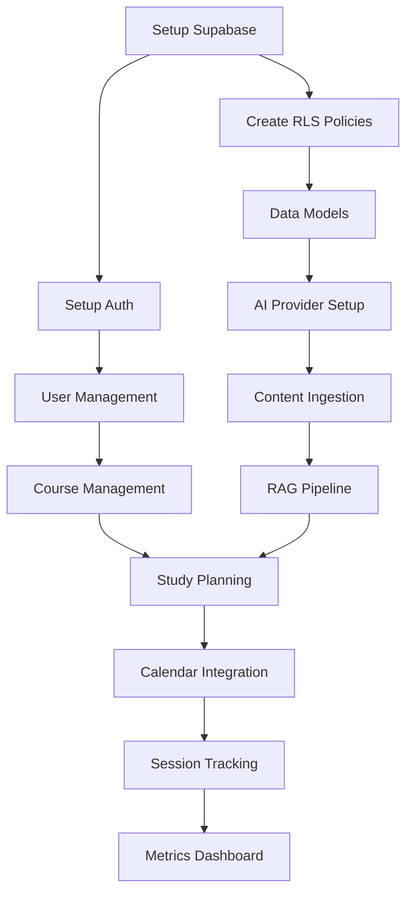

# Autonomous Workplan

## Purpose
Rolling plan for AI squad to maintain momentum and direction without approval gates.

## Current Phase: Foundation (Week 1)

### Priority 1: Core Infrastructure ✅
- [x] Documentation library structure
- [x] Stack decisions documented
- [ ] Monorepo scaffold with proper structure
- [ ] Supabase setup with RLS policies
- [ ] AI provider abstraction layer
- [ ] Basic auth flow with Google OAuth

### Priority 2: Minimum Viable Loop 🔄
- [ ] User can sign in with Google
- [ ] Create school/term/course hierarchy
- [ ] Upload and process syllabus (PDF → embeddings)
- [ ] Generate basic 7-day study plan
- [ ] View plan in calendar interface
- [ ] Complete one study session with metrics

### Priority 3: AI Intelligence 🧠
- [ ] RAG pipeline for Q&A on notes
- [ ] Spaced repetition with SM-2
- [ ] AI coach generates personalized recommendations
- [ ] Basic performance tracking dashboard

## Task Dependencies

## Next 5 Sessions Plan

### Session 1 (Current)
1. Complete docs library (150+ files)
2. Scaffold monorepo structure
3. Initialize Supabase project
4. Create basic database schema
5. Set up Next.js app with auth

### Session 2
1. Implement Google OAuth flow
2. Create user onboarding flow
3. Build course management UI
4. Set up AI provider abstraction
5. Test basic auth and data flow

### Session 3
1. Implement file upload and processing
2. Build RAG pipeline for content
3. Create study plan generation
4. Basic calendar view
5. Test content ingestion flow

### Session 4
1. Implement spaced repetition system
2. Build study session interface
3. Create metrics tracking
4. Dashboard with performance data
5. Test complete user journey

### Session 5
1. Polish UI/UX with shadcn components
2. Add keyboard shortcuts and accessibility
3. Performance optimization
4. E2E testing with Playwright
5. Deploy to staging environment

## Success Metrics per Session
- Session 1: All core infrastructure running locally
- Session 2: User can sign in and create courses
- Session 3: AI can answer questions about uploaded content
- Session 4: Complete study workflow from plan to metrics
- Session 5: Production-ready application deployed

## Risk Mitigation
- **Supabase limits**: Monitor usage, implement caching
- **AI costs**: Set daily budgets, fallback to local models
- **Complexity creep**: Focus on minimal viable features first
- **Technical debt**: Maintain TypeScript coverage, write tests

## Quality Gates
Each session must achieve:
- [ ] All TypeScript errors resolved
- [ ] ESLint warnings < 5
- [ ] Critical user flows working end-to-end
- [ ] No broken buttons or dead-end states
- [ ] RLS policies tested and secure

## Backlog Priorities
1. **P0**: Core user journey (auth → content → plan → study → metrics)
2. **P1**: AI intelligence (RAG, recommendations, SRS)
3. **P2**: Polish (accessibility, performance, mobile)
4. **P3**: Advanced features (collaboration, integrations)

## Auto-Update Schedule
This workplan updates after each session with:
- Completed tasks marked ✅
- New tasks discovered during implementation
- Risk assessment and mitigation updates
- Next session priorities adjusted based on progress

Last updated: 2025-08-12 (Session 1 - Foundation)